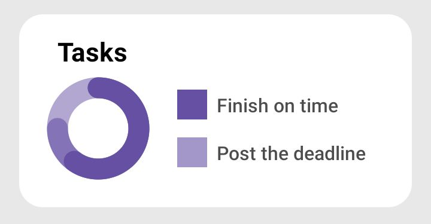

# Circular Progress bar

>Sample of jetpack compose drawing api.
enable you to setup tow progresses.

## Screenshot
[](screenshots/Screenshot_20221220-231119.jpg)

## Usage
```
CircularProgress(  
	modifier = Modifier.size(100.dp),  
	values = {  
		ProgressValues(  
			primary = 60f,  
			secondary = 75f  
		)  
	},  
	maxValue = 100f,  
	strokeWidth = 35f  
)

# Also you can define animation spec using optional params (animationSpec).
# and add content to center of progress bar using optional params (centerContent)
```
